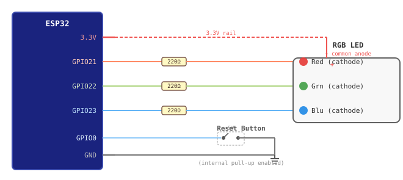

# ESP32 NTRIP Duo

Dual NTRIP caster client firmware for ESP32. Reads RTCM3 correction data from a [Unicore UM980](https://en.unicorecomm.com/products/detail/24) GNSS receiver and pushes it simultaneously to two NTRIP casters (e.g. RTK2go and Onocoy).

Based on [nebkat/esp32-xbee](https://github.com/nebkat/esp32-xbee), heavily modified.

---

## Features

- **Dual NTRIP output** — two independent caster connections running in parallel
- **Web UI** — configure WiFi, NTRIP credentials, UART settings from a browser
- **OTA firmware updates** — upload new firmware over WiFi at `http://<device-ip>/ota`
- **Live log** — stream device logs in real time at `http://<device-ip>/log.html`
- **Remote diagnostics** — `/status` JSON endpoint (heap, uptime, reset reason, stream stats), `/core_dump` download
- **Auto-reconnect** — exponential backoff on caster disconnect, WiFi reconnect with watchdog restart
- **Heap watchdog** — auto-restarts if free heap drops below 20 KB to prevent silent lockups

---

## Hardware

| Component | Details |
|-----------|---------|
| MCU | ESP32 (4 MB flash), e.g. ESP32-WROOM-32 dev board |
| GNSS receiver | Unicore UM980 |
| UART | TX GPIO1, RX GPIO3 (default) |
| LED (optional) | GPIO21 Red, GPIO22 Green, GPIO23 Blue (common anode, active low) |



**Power supply note:** The ESP32 and UM980 share a 5 V rail. Add a 470 µF + 100 nF capacitor across the 5 V rail at the UM980 power pins to prevent voltage sag during WiFi TX spikes.

**UM980 setup:** The receiver must be configured in BASE mode before RTCM output is available:

```text
MODE BASE
SAVECONFIG
```

---

## Pre-built firmware

**Use the [latest release](https://github.com/designer2k2/esp32-ntrip-DUO/releases/latest)** — binaries are built automatically by CI and attached to every release:

| File | Use for |
|------|---------|
| `ESP32-NTRIP-DUO-flash.bin` | **First-time flash** — full image (bootloader + partition table + firmware + web UI). Use with ESPHome web flasher or `esptool.py`. |
| `ESP32-NTRIP-DUO-ota.bin` | **OTA updates** — app binary only. Upload at `http://<device-ip>/ota` after the first flash. |

> **Important:** always use the matching pair from the same release. Do not OTA-flash the full `flash.bin` — it will fail validation. Do not first-flash with the `ota.bin` alone — it is missing the bootloader and partition table.

The `firmware/` folder in the repository tracks the last manually committed build and may lag behind the latest release.

---

## Build & Flash

**Requirements:** [ESP-IDF v5.4.x](https://docs.espressif.com/projects/esp-idf/en/v5.4/esp32/get-started/)

### Build

```cmd
idf.py build
idf.py merge-bin -o firmware\ESP32-NTRIP-DUO-flash.bin
```

Output files:

| File | Use for |
|------|---------|
| `build\esp32-xbee.bin` | OTA updates via `http://<device-ip>/ota` |
| `firmware\ESP32-NTRIP-DUO-flash.bin` | First-time flash via ESPHome or esptool |

### First-time flash — ESPHome Web Flasher (no tools required)

1. Open [https://web.esphome.io](https://web.esphome.io) in Chrome or Edge
2. Connect the ESP32 via USB, click **Connect**, select the COM port
3. Click **Install**, select `firmware\ESP32-NTRIP-DUO-flash.bin`

Flashes bootloader + partition table + firmware + web UI in one step.

### First-time flash — idf.py (requires ESP-IDF)

```cmd
idf.py flash
```

### OTA updates (after first flash — no USB required)

Go to `http://<device-ip>/ota` and upload `build\esp32-xbee.bin`.

---

## Flash layout

| Partition | Size | Description |
|-----------|------|-------------|
| nvs | 24 KB | Configuration (WiFi, NTRIP credentials) |
| factory | 1 MB | Primary firmware |
| ota_0 | 1 MB | OTA update target |
| www | 1 MB | Web UI files (SPIFFS) |
| coredump | 192 KB | Crash core dump storage |
| otadata | 8 KB | OTA boot partition selector |

---

## First boot

1. Device starts a WiFi hotspot (`ESP32_*`)
2. Connect and open `http://192.168.4.1`
3. Enter your WiFi credentials and NTRIP caster details
4. Save — device restarts and connects

---

## Remote diagnostics

Since the device is typically deployed without serial access:

| URL | Description |
|-----|-------------|
| `http://<ip>/log.html` | Live log stream |
| `http://<ip>/status` | JSON: heap, uptime, reset reason, stream byte counts |
| `http://<ip>/core_dump` | Download crash core dump (if available) |
| `http://<ip>/ota` | OTA firmware update page |

Analyse a core dump:

```cmd
idf.py coredump-info -c core_dump.bin
```
